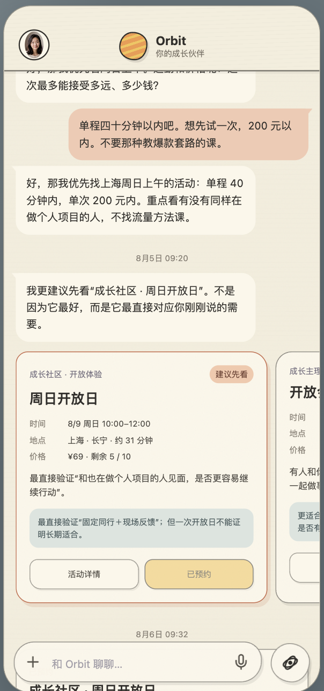

# Orbit 互动 Demo

[English](./README.md) · **中文** · [日本語](./README.ja.md)

**Orbit —— 你专属的 AI 成长伙伴，让个人成长自然发生。**

对于离开学校不久、独立生活在陌生城市的职场新人，个人成长上容易陷入迷茫和无力：理不清目标，找不到路径，更找不到一起向前的战友，到最后甚至选择放弃。Orbit 致力于帮职场新人打造自己的成长轨迹，成为想成为的人。

## 在线 Demo

https://candybox-ai.github.io/orbit-demo/

预置数据模拟一段从困惑、尝试行动、参加线下活动到复盘的经历，呈现核心流程。未接入生产级 LLM、ASR 与后端。




打开后可以玩：

- **成长地图（默认主界面）**：查看成长主题与轨迹；点击节点看事件与变化依据
- **Chat（右下角进入）**：像朋友聊天一样理解困惑与阻力，在对话里选择线下活动卡片，接收提醒，并完成复盘

## Orbit 能为你做什么

正式产品里，Orbit 不仅让成长自然发生，还让你看见自己的成长。本 Demo 可体验其中的核心流程：

- 持续理解你的困惑或目标
- 帮你制定可执行的计划
- 连接线下同频的人，将你带入利于成长的环境中
- 记录成长过程，并用游戏的方式呈现

## 本地运行

先克隆本仓库，再安装并启动：

```bash
git clone https://github.com/candybox-ai/orbit-demo.git
cd orbit-demo
pnpm install
pnpm dev
```

浏览器访问 `http://127.0.0.1:5173/orbit-demo/`。

## 验证

```bash
pnpm typecheck
pnpm test
pnpm build
```

## 更新在线 Demo

把改动推送到 `main` 后，在线 Demo 会自动更新（无需手动上传页面）。

## 隐私

- 不要提交 API Key、真实录音或个人隐私文件。
- 演示数据可以改，但请保持可公开。

## 路线图

- 支持微信和手机号登录
- 支持接入多种大语言模型
- 线下活动相关功能

## 反馈

https://github.com/candybox-ai/orbit-demo/issues

## 致谢

本仓库由 Codex、Grok Bot 协助整理与发布。
